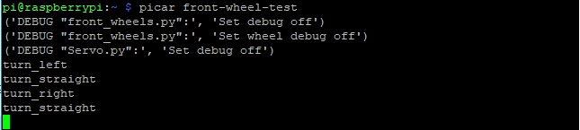
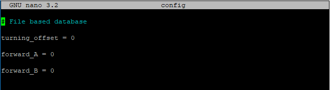
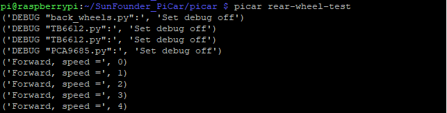

Calibration
===========

Calibrate the Servo
-------------------

Remember the commands to adjust the servo to 90 degrees previously? Now,
let’s talk about the other two commands.

The second command **front-wheel-test** is used to test whether the
front wheels can turn flexibly after assembly. When you run this
command, it will drive them to turn left and right.

.. code-block::

    picar front-wheel-test

You may find the direction of the front wheels is not facing exactly
front when they are in the straight status. If there is an obvious
deviation from the middle line of the front chassis, reassemble the
servo and run **servo-install** again; if it is just a little deviation
(like about 0~15 degrees), it can be adjusted by software.

Get into the folder **SunFounder_PiCar/picar:**

.. code-block::

    cd /home/pi/SunFounder_PiCar/picar

.. code-block::

    sudo nano config

Open the **config** file under the folder with an editor. You can see a
few parameters. The value of **turning_offset** is used to adjust the
front wheels. Its value is **0** by default. If you want to make the
front wheels **turn right a bit**, just modify it to a **larger
numbe**\ r; to make it more **towards the left**, you can set it
**smaller** (it can even be a negative number).

But **DO NOT** over-configure the wheels (recommended a value between
-30 and 30), or the servo may be stuck and broken.

After changing the value of turning_offset, press **Ctrl** + **O** to
save the changes, and press **Ctrl** + **X** to exit. Run the command
**picar servo-install** to check the front wheel’s status.

.. code-block::

    picar servo-install

If the front wheels is still not facing the exact front, you may need to
edit the file **config** for a couple of times. The front wheels may
need to be adjusted about 3 to 5 times usually. We can move on to
calibration of the rear wheels when the front wheels are done.

Calibrate the Motors
--------------------

Since the wiring of the two DC motors is random, the VCC and GND of a
motor may be connected to the wheel reversely, causing the wheel to spin
forward when it should do backward as configured in the code. Thus we
can use the third command which will drive the rear wheels to
simultaneously speed up and slow down alternately.

.. code-block::

    picar rear-wheel-test

Check whether both the two rear wheels rotate direction is the same as
the screen. Note that the two wheels are driven by the two motors
separately. It may happen that one rotates forward, while the other does
backwards. If so, we need to adjust one or both two wheels which rotate
reversely under that command.

.. code-block::

    cd /home/pi/SunFounder_PiCar/picar

.. code-block::

    sudo nano config

**forward_A** and **forward_B** are to change the default spinning
direction of the two motors. The value can only be **0** or **1**, which
represents clockwise and counterclockwise rotation. By default, it's
**0** for both parameters. Thus if a wheel spins reversely, you only
need to change the corresponding parameter for the wheel to **1**.

Press **Ctrl** + **O** to save the changes, and press **Ctrl** + **X**
to exit.

Run the command **picar rear-wheel-test** again to check whether the
rear wheels are rotating in accordance with the command.

.. code-block::

    picar rear-wheel-test

Copy *config* to the directory *example* under *PiCar-S*.

.. code-block::

    cp config ~/SunFounder_PiCar-S/example
