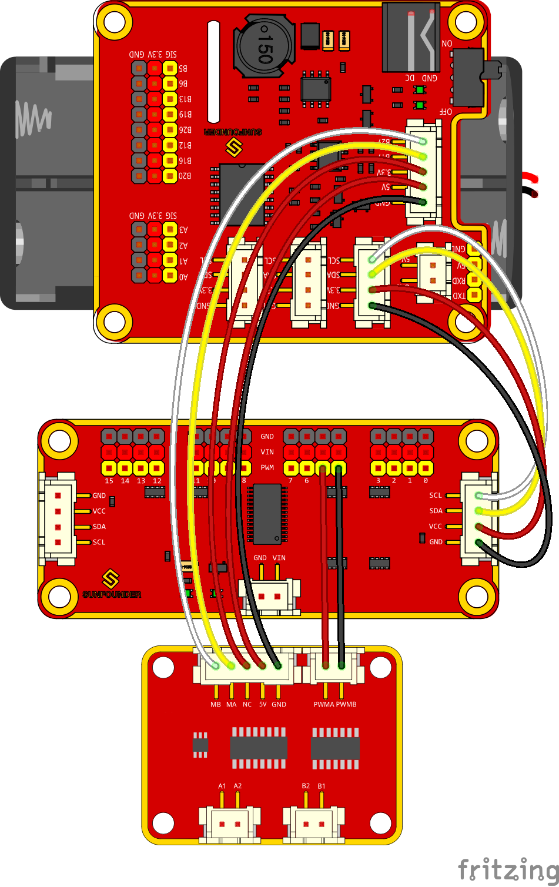
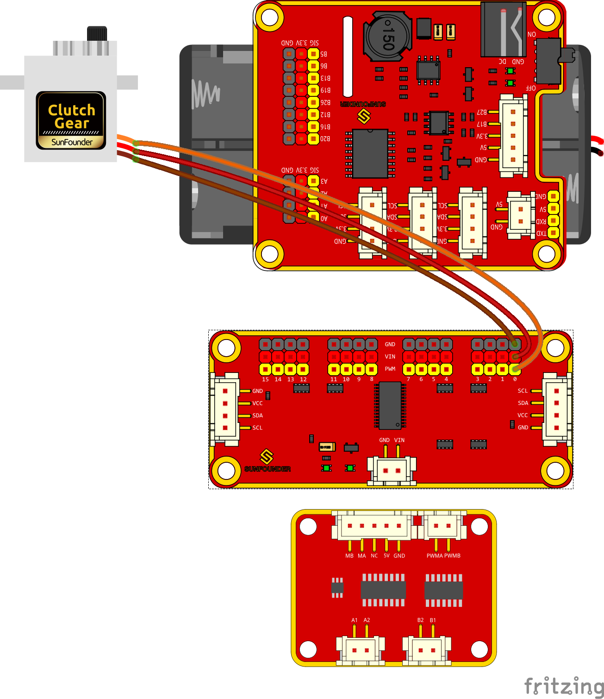
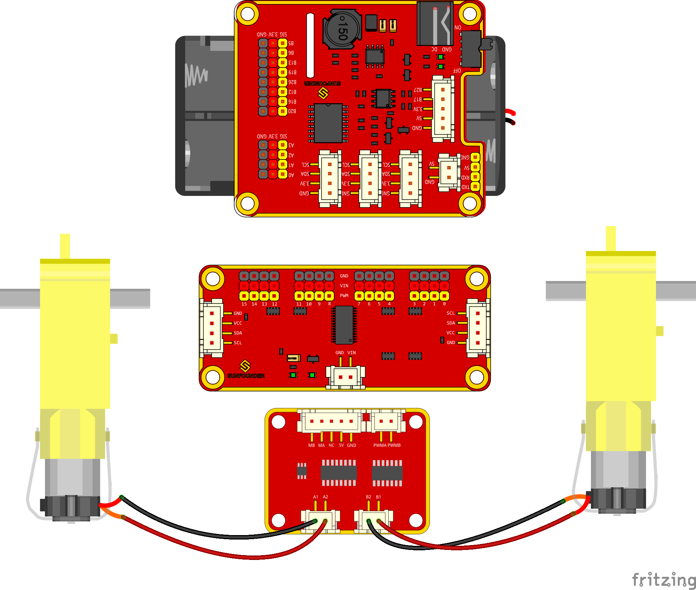
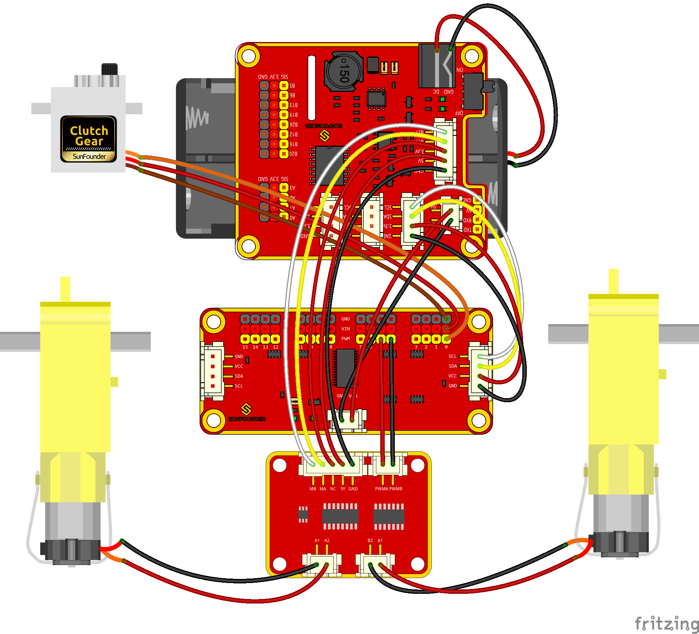

Circuits Building
=================

Connect the Power
-----------------

.. image:: media/image69.png
   :alt: connect-power_bb
   :width: 5.42361in
   :height: 7.95in

Connect the Modules
-------------------

Connect the Servo
-----------------

Connect the Motor
-----------------

The complete connection is shown as follows.

So now the circuit boards are all installed onto the car and the wiring
is done. But still you're not ready to adjust the servo yet. First you
need to complete some software installation.
