Get Started with Raspberry Pi
=============================

In this chapter, we firstly learn to start up Raspberry Pi. The content
includes installing the OS, Raspberry Pi network and how to open
terminal.

.. note::
     You can check the complete tutorial on the official website of the Raspberry Pi:
     https://projects.raspberrypi.org/en/projects/raspberry-pi-setting-up

.. note::
    If your Raspberry Pi is set up, you can skip the part and go into the next chapter.

Installing the OS
-----------------

**Required Components**

================== ======================
Any Raspberry Pi   1 \* Personal Computer
1 \* Micro SD card 
================== ======================

**Step 1**

Raspberry Pi have developed a graphical SD card writing tool that works
on Mac OS, Ubuntu 18.04 and Windows, and is the easiest option for most
users as it will download the image and install it automatically to the
SD card.

Visit the download page: https://www.raspberrypi.org/software/. Click on
the link for the Raspberry Pi Imager that matches your operating system,
when the download finishes, click it to launch the installer.

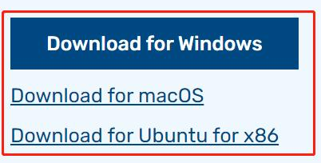

**Step 2**

When you launch the installer, your operating system may try to block
you from running it. For example, on Windows I receive the following
message:

If this pops up, click on **More info** and then **Run anyway**, then
follow the instructions to install the Raspberry Pi Imager.

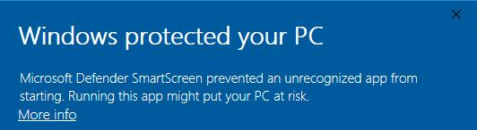

**Step 3**

Insert your SD card into the computer or laptop SD card slot.

**Step 4**

In the Raspberry Pi Imager, select the OS that you want to install and
the SD card you would like to install it on.

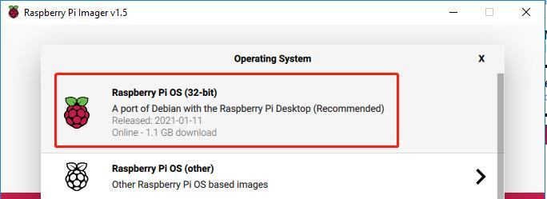

.. note::

    1) You will need to be connected to the internet the first time.

    2) That OS will then be stored for future offline
    use(lastdownload.cache, C:/Users/yourname/AppData/Local/Raspberry
    Pi/Imager/cache, ). So the next time you open the software, it will
    have the display "Released: date, cached on your computer".

**Step 5**

Select the SD card you are using.

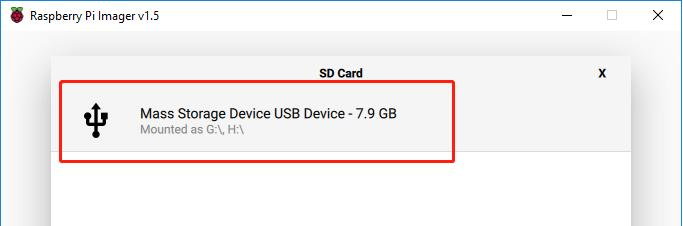

**Step 6**

Press **Ctrl+Shift+X** to open the **Advanced options** page to enable
SSH and configure wifi, these 2 items must be set, the others depend on
your choice . You can choose to always use this image customization
options.

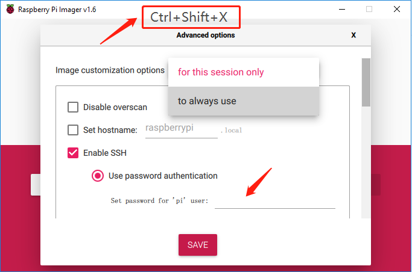

Then scroll down to complete the wifi configuration and click **SAVE**.

.. note::
    **wifi country** should be set the two-letter `ISO/IEC alpha2
    code <https://en.wikipedia.org/wiki/ISO_3166-1_alpha-2#Officially_assigned_code_elements>`__ for
    the country in which you are using your Raspberry Pi, please refer to
    the following link:
    https://en.wikipedia.org/wiki/ISO_3166-1_alpha-2#Officially_assigned_code_elements

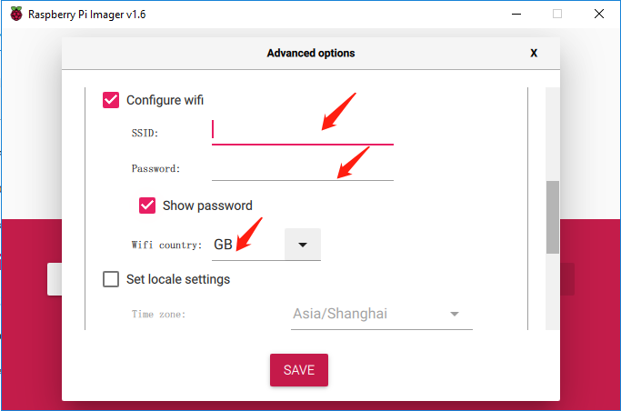

**Step 7**

Click the **WRITE** button.

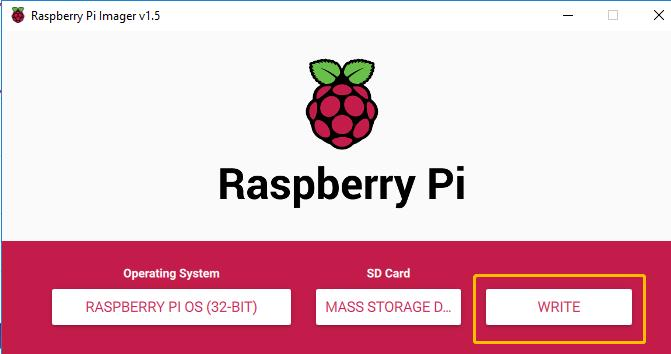

**Step 8**

If your SD card currently has any files on it, you may wish to back up
these files first to prevent you from permanently losing them. If there
is no file to be backed up, click **Yes**.

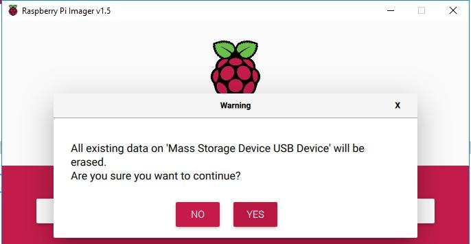

**Step 9**

After waiting for a period of time, the following window will appear to
represent the completion of writing.

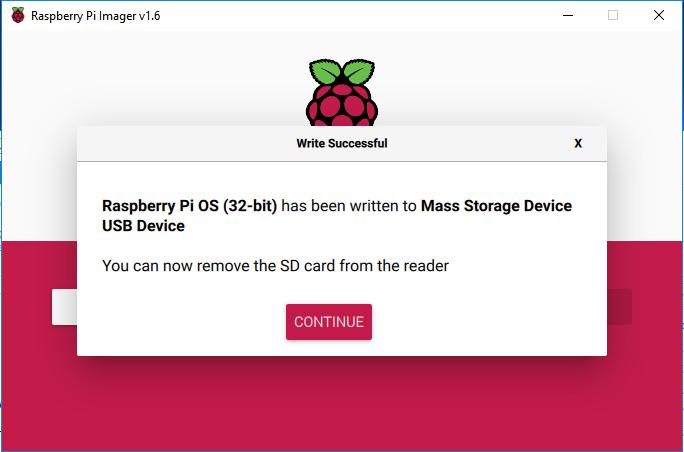

Power on the Raspberry Pi
-------------------------

Now, the Raspberry Pi OS is configured. You can plug out the USB card
reader and then plug the Micro SD card into the Raspberry Pi.

Put two 18650 fully charged batteries in the holder, plug the wires from
the battery holder into the development board then toggle the switch
from off to on. You are also recommended to use the power adapter of
Raspberry Pi to power your car for that the first test will take a long
time.

Get the IP Address
------------------

After the Raspberry Pi is powered on, we need to get the IP address of
it. There are many ways to know the IP address, and two of them are
listed as follows.

**1.  Checking via the router**

If you have permission to log in the router(such as a home network), you
can check the addresses assigned to Raspberry Pi on the admin interface
of router.

The default hostname of the system, Raspberry Pi OS is **raspberrypi**,
and you need to find it. (If you are using ArchLinuxARM system, please
find alarmpi.)

**2. Network Segment Scanning**

You can also use network scanning to look up the IP address of Raspberry
Pi. You can apply the software, **Advanced IP scanner(download from
Google)**.

Click **Scan** and the name of all connected devices will be displayed.
Similarly, the default hostname of the Raspberry Pi OS is
**raspberrypi**, now you need to find the hostname and its IP.

.. image:: media/image83.png
   :width: 6.13264in
   :height: 2.47431in

Use the SSH Remote Control
--------------------------

We can open the Bash Shell of Raspberry Pi by applying SSH. Bash is the
standard default shell of Linux. The Shell itself is a program written
in C that is the bridge linking the customers and Unix/Linux. Moreover,
it can help to complete most of the work needed.

For Linux or/Mac OS X users
^^^^^^^^^^^^^^^^^^^^^^^^^^^^^^^^^^^^^^

**Step 1**

Go to **Applications**->\ **Utilities**, find the **Terminal**, and open
it.

**Step 2**

Type in **ssh pi@ip_address** . “pi”is your username and “ip_address” is
your IP address. 
For example:

.. code-block::

    ssh pi@192.168.18.197

**Step 3**

Input”yes”.

.. image:: media/image226.png

**Step 4**

Input the passcode and the default password is **raspberry**.

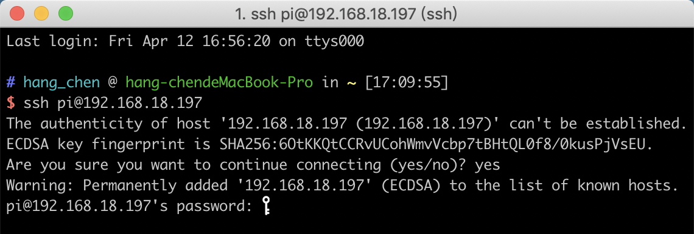

**Step 5**

We now get the Raspberry Pi connected and are ready to go to the next
step.

.. image:: media/image86.png
   :alt: IMG_277
   :width: 6.86528in
   :height: 5.44444in

.. note::
    When you input the password, the characters do not display on
    window accordingly, which is normal. What you need is to input the
    correct passcode.

For Windows Users
^^^^^^^^^^^^^^^^^^^^^^^^^^^^^^^^^^^^^^

If you're a Windows user, you can use SSH with the application of some
software. Here, we recommend **PuTTY**\ (You can download from Google).

**Step 1**

Download PuTTY. Open PuTTY and click **Session** on the left tree-alike
structure. Enter the IP address of the RPi in the text box under **Host
Name (or IP address)** and **22** under **Port** (by default it is 22).

.. image:: media/image87.png
   :alt: IMG_278
   :width: 6.3125in
   :height: 5.59375in

**Step 2**

Click **Open**. Note that when you first log in to the Raspberry Pi with
the IP address, there prompts a security reminder. Just click **Yes**.

**Step 3**

When the PuTTY window prompts “\ **login as:”**, type in
“\ **pi”**\ (the user name of the RPi), and **password: “**\ raspberry”
(the default one, if you haven't changed it).

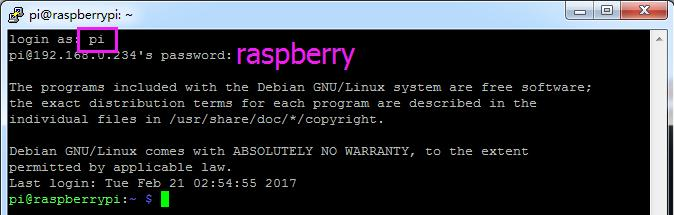

Here, we get the Raspberry Pi connected and it is time to conduct the
next steps.