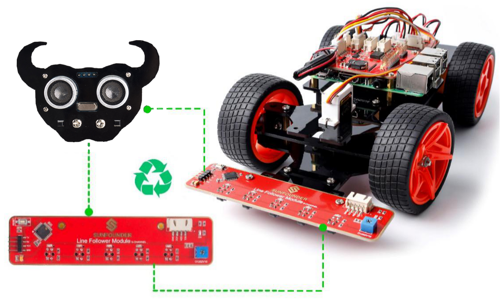

Introduction
============

The PiCar-S is a **SMART SENSOR** car robot based on Raspberry Pi, which
comes with three sensor modules, including the light follower, line
follower and ultrasonic obstacle avoidance. With these modules, this
smart car is capable of some simple automatic actions. Thus, you can
learn some basics of programming in Python to control the car with these
sensors. Let’s start with building this smart car!

