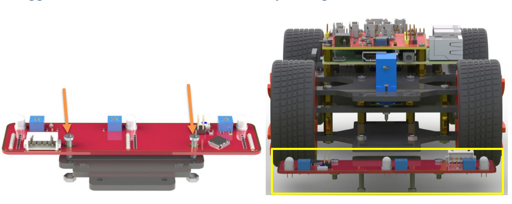
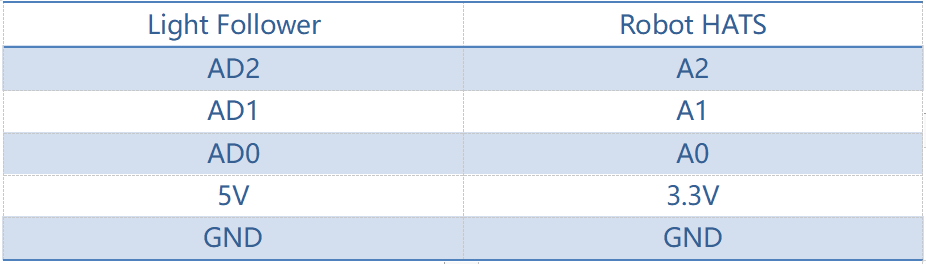
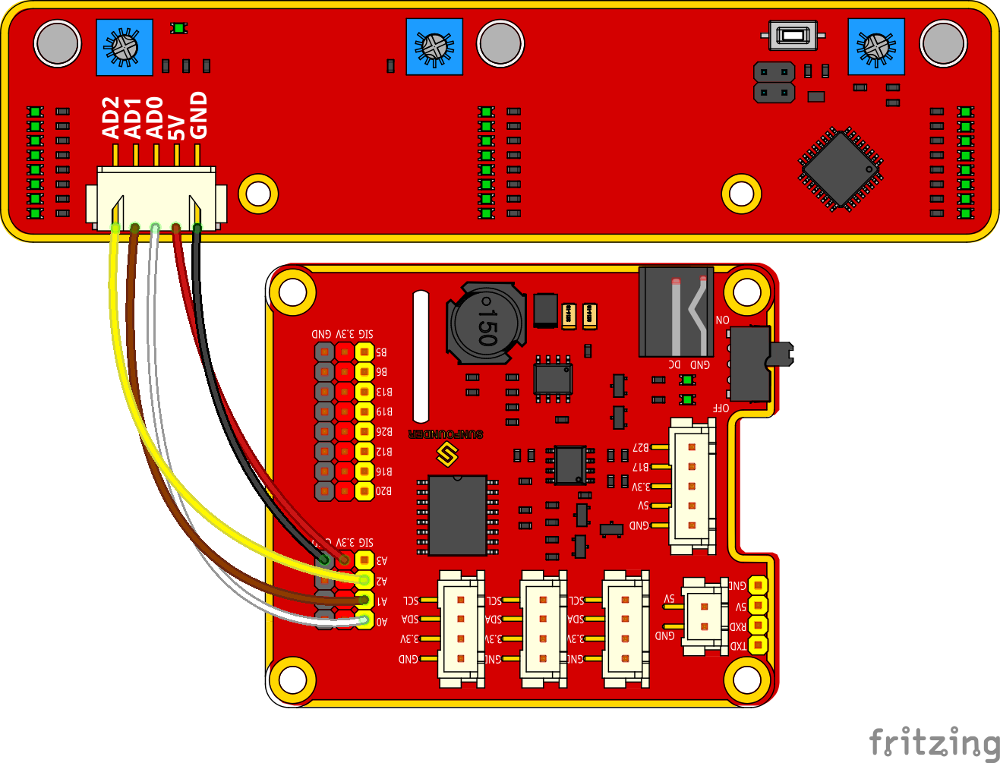
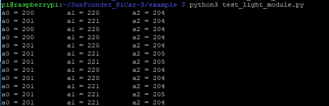
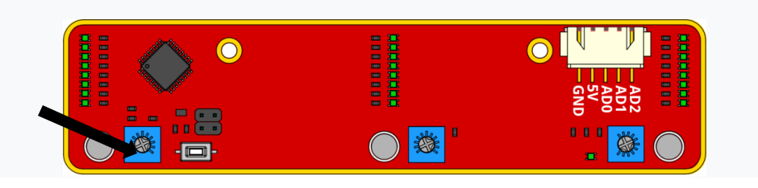
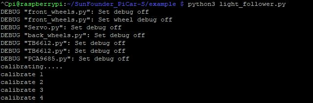
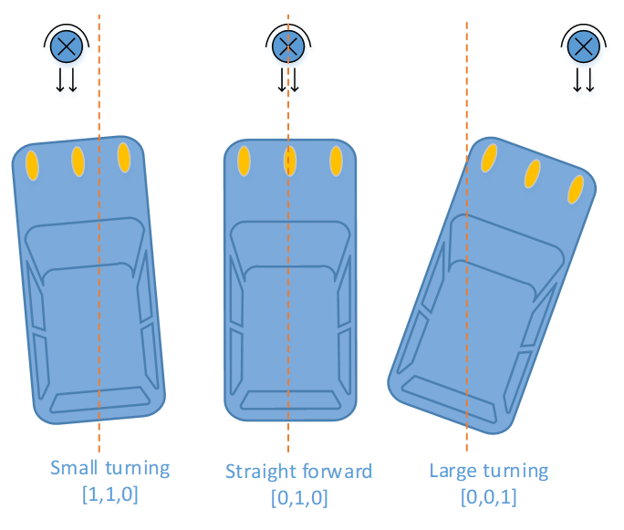
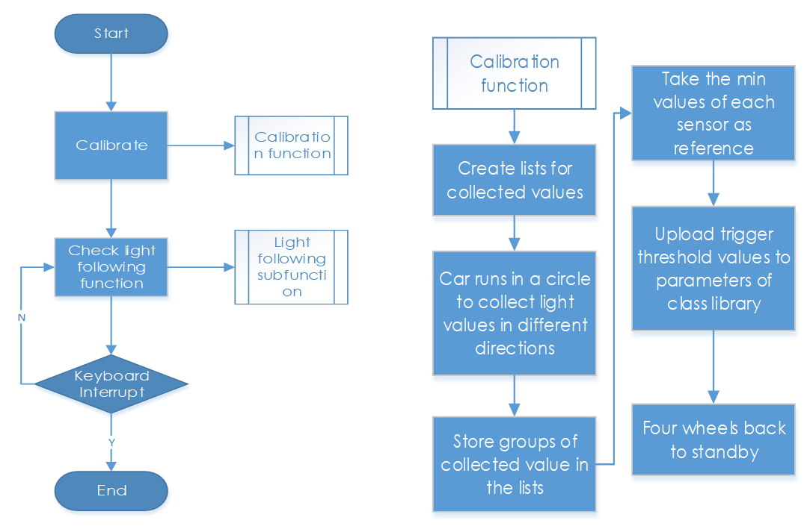
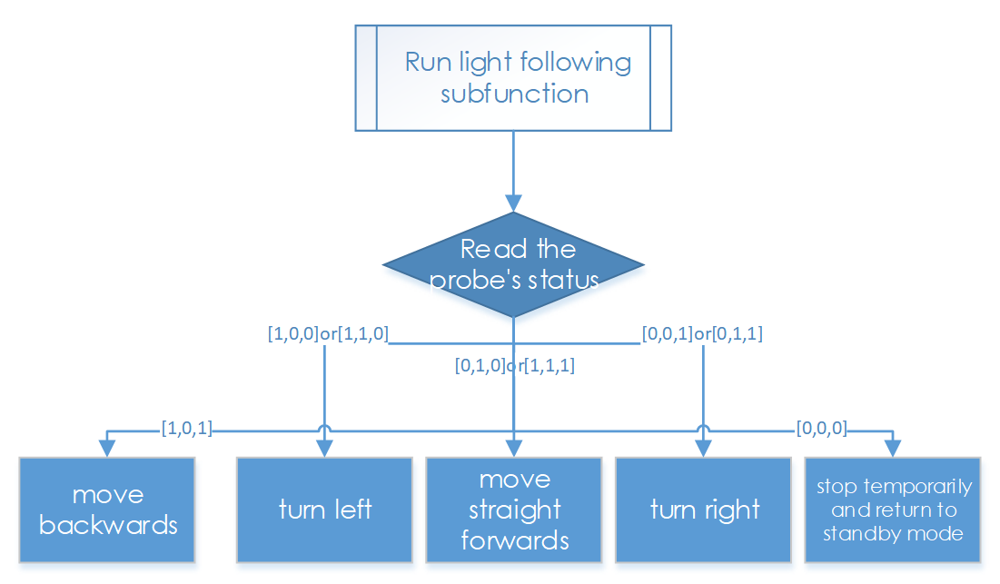

Light Following
================

How It Works
-------------

The light follower module detects light sources in the surroundings, and
transfers the data to the processor. The processor analyzes the data and
finds the direction of the light resource, so it will send a command to
control the movement of the front and rear wheels to approach the
resource.

Procedures
-----------

**Step 1 Assembly**

Connect the light follower to the Sensor Connector with **M3*10 screws**
and **M3 nuts**, and then assemble them to the car with two **M3*10
screws** and two **M3 nuts**. You're suggested to hold the nuts
underneath with your fingers.

**Step 2 Wiring**

Connect the light follower to the Robot HATS with a 5-pin anti-reverse
cable as shown below.

.. note::
    You may wonder why we connect 5V to 3.3. Well, since the
    working voltage of the STM8 chip on the light follower is 2.7-5.5V, we
    can connect it to 3.3V here. **DO NOT** connect 5V to 5V! All the analog
    ports on the Robot HATS are led from the PCA8591, which is powerd by
    3.3V. Therefore, if the voltage is between 3.3V-5V, the output value
    will always be 255, thus the PCA8591 may be damaged if connected to 5V.
    Remember to connect to **3.3V**.

The wiring is shown as below:

**Step 3 Test**

Let’s test the light follower first.

.. code-block::

    cd ~/SunFounder_PiCar-S/example/

.. code-block::

    python3 test_light_module.py

Expose the phototransistors to the light spot of the flashlight. When
you increase the light intensity, more LEDs light up, and the output
values decrease.

Here we can rotate the blue adjustable resistor to change the values
under the same light luminance. The best status is as follows:

1) When there is only one LED lights up, the output value is 255

2) When the light is the brightest and all the LED light up, the output
   value is about 10-25.

**Step 4. Get on the road!**

.. code-block::

    python3 light_follower.py

The car will enter the light following configuration mode when we run
the code above. It will keep turning to the right in a circle to gather
the information of light condition in different directions. So just
place the car in an open field and wait.

When the calibration is done, the car will stop temporarily. Shine a
flashlight on the light follower module, and the car will just follow
the light spot as you moves it.

Code Explanation for light_follower.py
----------------------------------------

**Whole Work Flow**

1. Light-sensitive sensors need to be calibrated before actual use
   because of complex light conditions in the environment. It gathers
   the information of the ambient light luminance. The car can follow
   light only when the light source is brighter than the surroundings.

Here write two main functions/modules including light following
calibration and light following in the main program.

**Subflow of Light Follower Calibration Function**

We need to configure three light-sensitive components separately, so we
set three lists to store the values in A0, A1, and A2 collected for
multiple times. Then pick out the minimum values, which are the output
analog values in the brightest conditions.

Since the light source we use is much brighter than the ambient light,
we should take the output values in the brightest conditions as
reference.

Besides, we should set a threshold value - when the gap between the
collected value of the light source and that of the environment is
beyond the threshold, trigger the value switching to 0 or 1. Here we use
[0,0,0] to represent the three photoresistors’ status when they are not
triggered. "0" will become "1" when the value detected of the
corresponding photoresistor is higher than the threshold. Thus we can
set the related action of the car according to the three-element list.

If there is light detected, the car will move and follow it; if there is
no light detected, the car will stop temporarily and keep turning to
detect in a circle.

**Subflow of Light Following Function**

The light follower includes three phototransistors, thus its status list
is composed of three elements which represent 8 statuses (based on
permutation and combination). And here we need to set related responses
to these statuses.

The three elements show the status of the three probes: 1 represents
light detected, and 0, for none. For example, [1,0,0] shows that light
is detected only by the left probe, meaning th light source is at the
left of the car, thus setting the car’s response action as turning left;
[1,1,0] means that light is detected on the left and central probes,
thus its response action should be set turning left too; and set it as
turning right the same way according to the corresponding status. When
there is no light detected, the status is [0,0,0], so we set the
response action to stop and return to the standby mode.

.. image:: media/image243.png

Here, we need to set another variable – the steering angle – to
distinguish between the large-angle and small-angle turning. If the
light is at the central left side (status [1,1,0]), we should apply a
small-angle turning; if the light is at the edge of the left side
(status [1,0,0]), we should apply a large-angle turning.

**Functions Explanation**

To understand the code, take the software subflows above for reference.

Three Python modules are used in the code including the imported
**light_follower_module**, **front_wheels**, and **back_wheel**
previously. They are drivers for this kit, respectively for light
following, front wheels and rear wheels.

The related classes have been defined here. When the modules are applied
to use, objects will be created for related classes, and different parts
of hardware will be driven by calling a function by the class object.

For example, for the light following module, we create an object named
**lf**:

**lf = Light_Follower.Light_Follower()**

Then we can call the function by a class object.

**A0 = lf.read_analog()[0]**

This function **read_analog()** will return a list with three elements,
which stores the detected analog values of three probes. Here we use
**A0 = lf.read_analog()[0]**, **A1 = lf.read_analog()[1]**, and **A2 =
lf.read_analog()[2]** to store three elements of returned value
separately into the variables A0-A2.

A **for()** loop is used here cycling 10 times, that is the car will
acquire the analog values ten times when the car drives in a circle
under the calibration mode. The minimum values will be taken as
reference here. If you need more samples, just increase the times of the
loop.

Store the detected values to a list in each loop by the
**env0_list.append(A0)** function. When the loop ends, the built-in list
function **reference[0] = min(env0_list)** in Python will pick out the
minimum in the list.

**lt_status_now = lf.read_flashlight()**

This is to read the status of the module, which will return a 3-element
list. This function is used to solve the possible problem caused by
brightness-adjustable flashlights. They blink repeatedly due to
brightness change by PWM method, so we add this function to the driver
library to prevent the car from moving and stopping repeatedly when the
light source lights up and goes out quickly or changes luminance by
ON/OFF ratio.

**fw.turn(turning_angle)**

Function for front wheels steering. The main program will call this
function if the front wheels are applied for steering. The parameter is
the turning angle.

**bw.forward()**

**bw.set_speed(forward_speed)**

Here we need two functions for rear wheels. The first function is to
control the rotating direction as forward (the function for backwards is
**bw.backward()**). The second one is to set the rotating speed of the
wheels; the parameter is the speed value (range: 0-100). The bigger the
parameter is, the faster the wheel rotates.