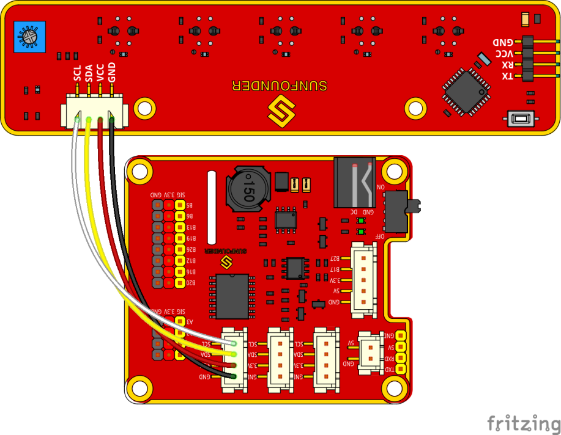
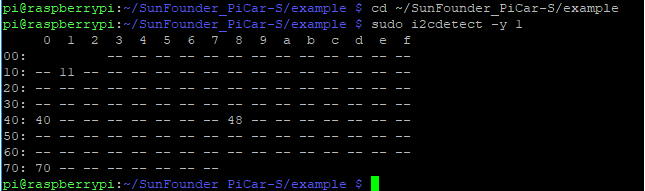
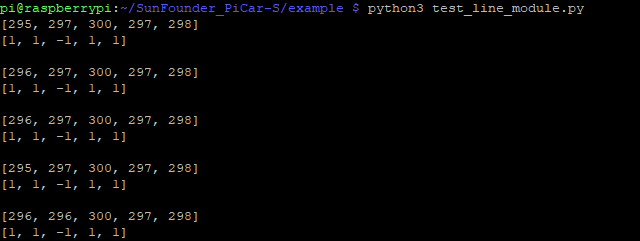
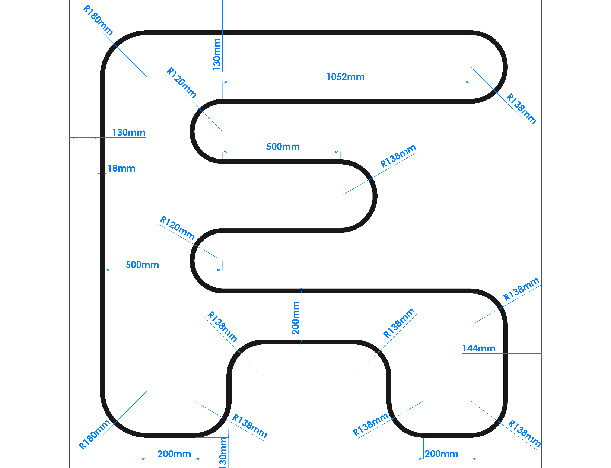
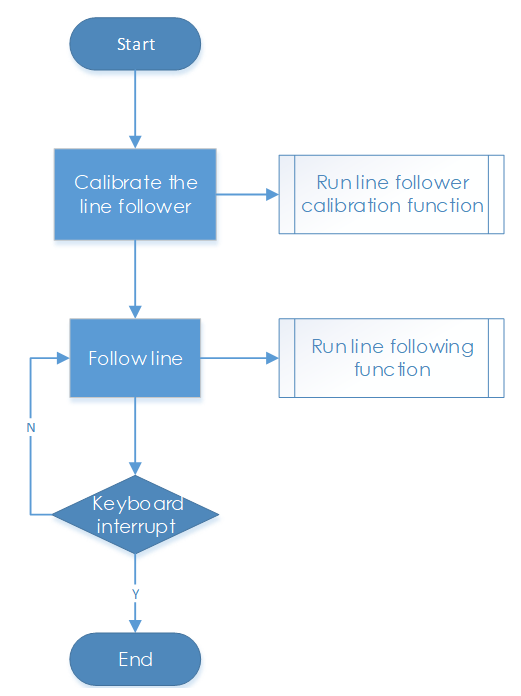
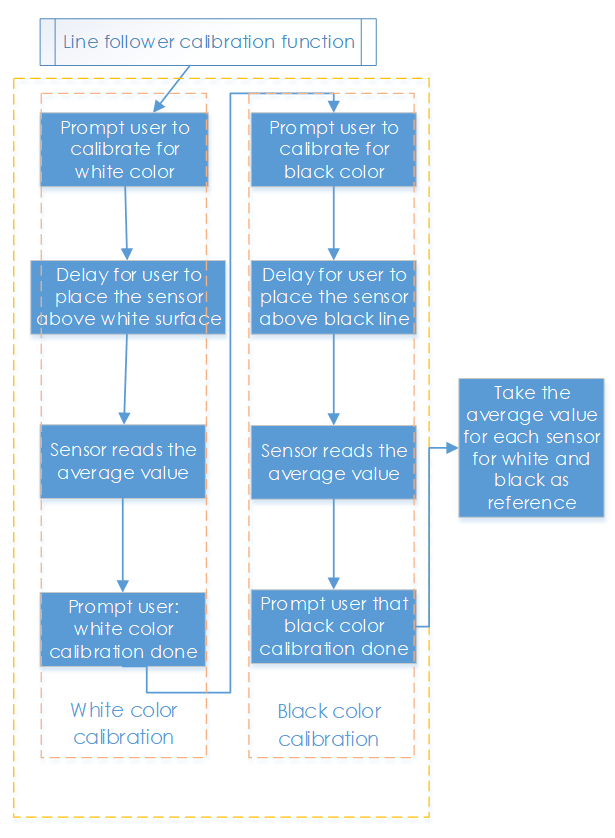
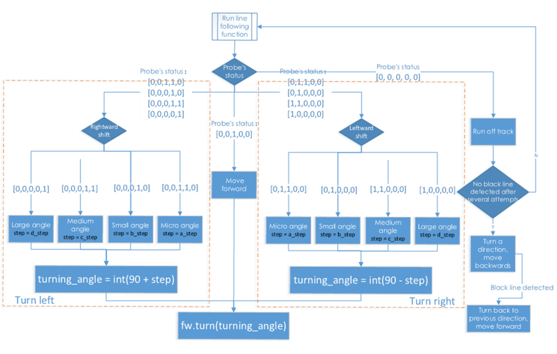
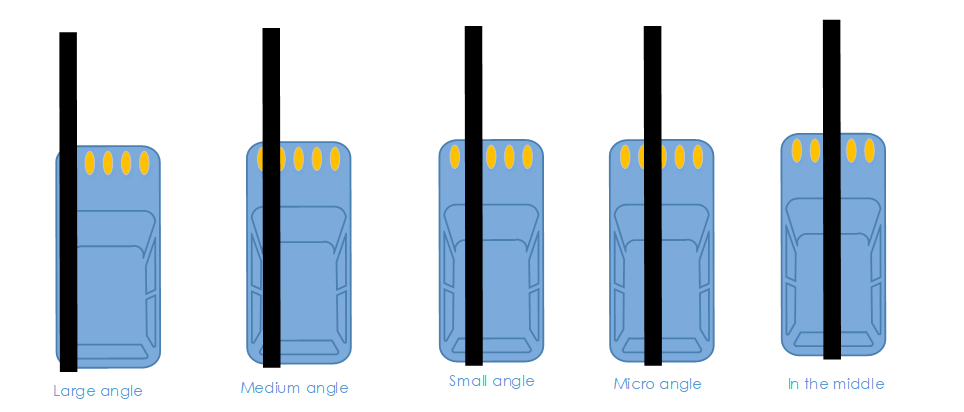
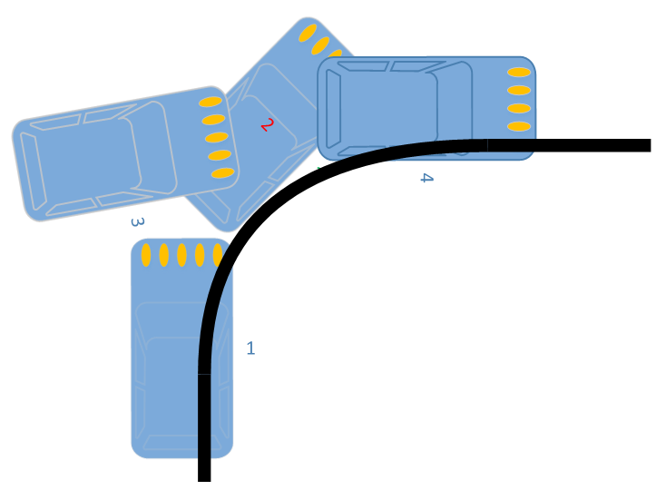

Line Following
==============

How it works
-------------

The line follower detects lines in the surrounding environment, and
transfers the data to the processor. The processor analyzes the data,
and sends a command to control the movement of front wheels and rear
wheels.

Procedures
-----------

**Step 1 Assembly**

Connect the light follower to the Sensor Connector with **M3*10 screws**
and **M3 nuts**, and then assemble them to the car with two **M3*10
screws** and two **M3 nuts**. You're suggested to hold the nuts
underneath with your fingers.

.. image:: media/image238.png

**Step 2 Wiring**

Connect the light follower to the Robot HATS with a 5-pin anti-reverse
cable as shown below.

**Step 3 Test**

Get into the directory example:

.. code-block::

    cd ~/SunFounder_PiCar-S/example

Check whether any i2c device is recognized or not via i2c-tools

.. code-block::

    sudo i2cdetect -y 1

We can see 11 is the line follower’s i2c address. If it is not shown, it
proves your wiring is not correct and the i2c communication with
Raspberry Pi fails too. You need to check the wiring before the next
step.

Run the test code.

.. code-block::

    python3 test_line_module.py

.. note::
    For the better working of line following module, we should
    adjust its sensitivity. The steps are as follows:

    Place the module on the white surface, read the value ; place it on
    balck surface, and read value.

    Calculate the difference, rotate potentiometer on the line following
    module toward the clockwise and anticlockwise till the diffence reaches
    up to the maximum. Now the debugging is finished.

**Step 4 Starts Running!**

Run the line follower code

.. code-block::

    python3 line_follower.py

A prompt of calibration will be printed on the screen when the program
starts to run. We will calibrate the module on a white surface first:
place all the five probes of the line follower above a white board. The
prompt of completed calibration will be printed on the screen a few
seconds later. Then let’s move on to calibration on black line. Also the
prompt of starting is printed on the screen, and then place all the
probes above the black lines. And the prompt of calibration completed
will be printed on the screen a few seconds later.

When the module calibration is all completed, we can run the car then.
Place the PiCar-S with probes above the black line on the white board,
and then it will go forward following the line itself.

How to make a track for line following
--------------------------------------

To make a track for the car to follow a black line, you need to prepare
the following materials:

A large sheet of paper, a roll of black tape (as black lines), a hard
card board (the size depending on the size of the track) or a flat
surface like the floor or desk.

1. Spread the paper out smoothly on the hard board, and paste on the
board or flat surface.

2. Paste the tape on the paper.

Rules for making:

1. Width of the black line: about 18-30mm, nearly the distance between
      two probes, no more than the minimum distance of two nonadjacent
      probes

2. The gap between two lines: more than 125mm, which is the width of the
      whole module, to prevent the car from getting confused when
      detecting two lines at the same time.

3. The semidiameter of curves: more than 138mm. When the front wheels
      turn left or right 45 degrees, the semidiameter of the path by
      which the car turns is equal to the wheelbase (the distance
      between the center of the front wheels and rear wheels). The car
      won't be able to turn and pass the curve smoothly if the
      semidiameter of the curve is too small.

A track sample is shown as below (the original map file can be found
under folder **map** in **github**):

Code Explanation of line_follower.py
------------------------------------

**Whole Work Flow**

Considering the interference of negative environment factors, we need to
calibrate the line follower sensor before actual use.

Here two main functions including the line follower calibration and line
following are included in the main program.

**Subflow of Line Follower Calibration Function**

When we run the line follower configuration, we will start from white
color, then black color, which is more like the upper limit and lower
limit of the sensor. Then we take the average value of black and white
as reference value: if the detected value is higher than the reference,
it should be white; if the detected is lower than the reference, it
should be black. We will show the five detectors’ status by 5 elements
[0,0,0,0,0].

**Subflow of Line Following Function**

In the line following function, we set the turning angle of the servo in
different levels according to the detection results of the probes. If
the line in front of the car is detected as a small curve, then the car
will turn a small angle; if it is a big one, the car will turn a large
angle. Thus, here we set four angle-turning constants: a_step, b_step,
c_step, and d_step.

When the car moves forward originally, the servo is in 90 degrees. To
drive the car to turn left, the servo should be in 90+step degrees; to
turn right, the servo should be in 90-step degrees.

There is a special case: if the car runs off the track, and all the
probes cannot detect the black lines any more, then it will continue the
program below.

In some case, especially when the car turns in a direction when the semi
diameter of the curve is very small (1), the car may run out of the
track and cannot detect any black line (2). If there is no response
program in such case, the car will be unable to follow the line again.
Thus we set the response program to let the car move backwards in the
opposite direction (3), and then turn back to the original direction
until a black line is detected again and move forward (4).

**Functions Explanation**

The logic of the code is just as shown in the flow chart above.

Three Python modules are used in the code, including the imported
**SunFounder_Line_Follower**, **front_wheels**, and **back_wheels**.
They are the drivers for this kit, respectively for line following ,
front wheels, and rear wheels

The related classes have been defined here. When the modules are applied
to use, objects will be created for related classes, and different parts
of hardware will be driven by calling a function by the class object.

Similar to the line following module, we create an object named **lf**:

**lf = Line_Follower_module.Line_Follower(references=REFERENCES)**

The parameter is initial, and then we can apply the function by calling
a class object.

**lf.read_digital()**

This function is used to read the analog signal of all probes, and
convert it into digital signal. If the signal is larger than the
reference, the corresponding parameter will be 0; if it is lower than
the reference, the parameter will be 1. There are five probes, thus we
will get a 5-parameter list.

**fw.turn(turning_angle)**

The function for front wheels' turning. The main program will call this
function if applying the front wheels for turning. The parameter is the
turning angle.

**bw.forward()**

**bw.set_speed(forward_speed)**

Here we need two functions for rear wheels. One is to control the
rotating direction as forward (for rotating backwards,
**bw.backward()**). The second one is to set the rotating speed; the
parameter is the speed value (range 0~100). The bigger the parameter is,
the faster the wheel rotates.
