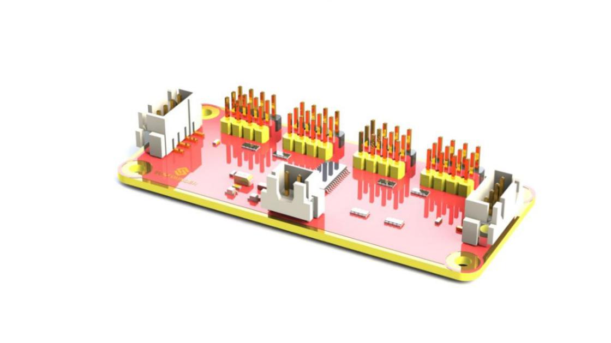
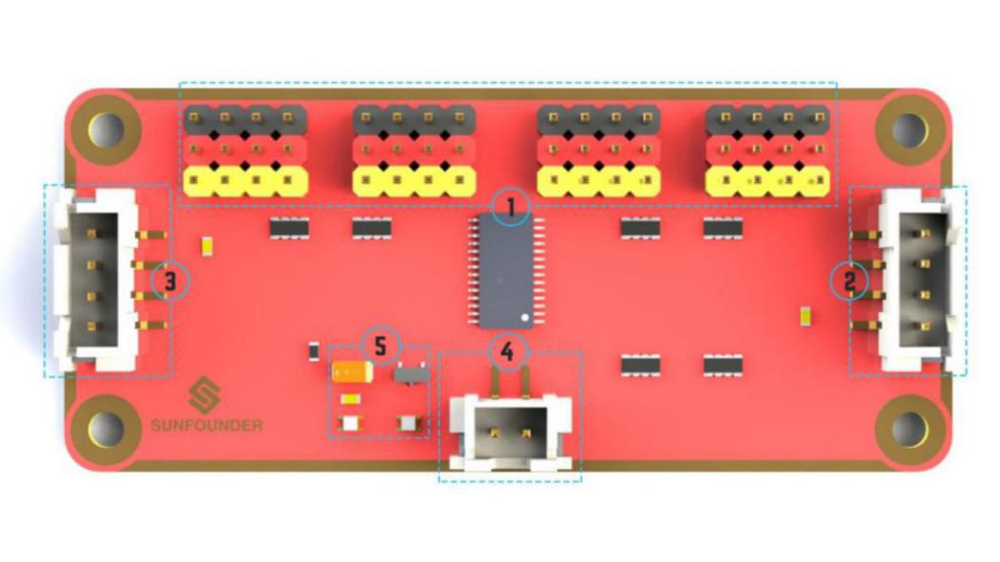
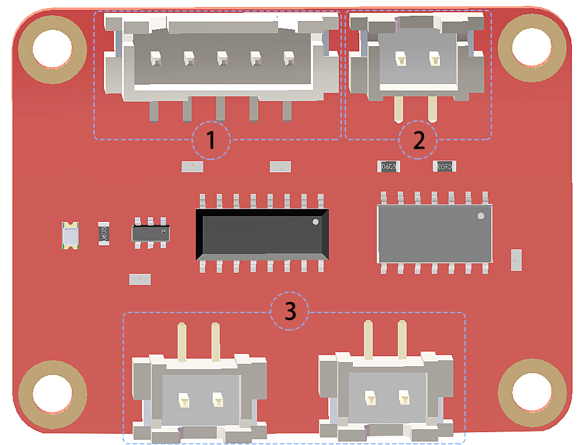
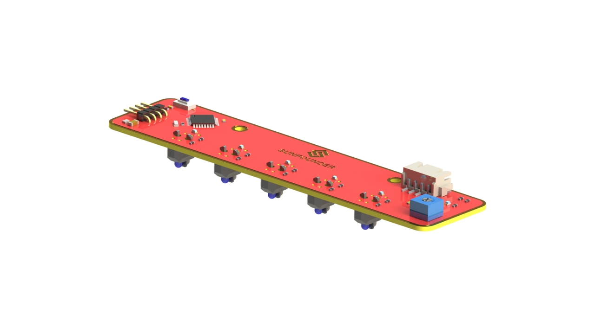
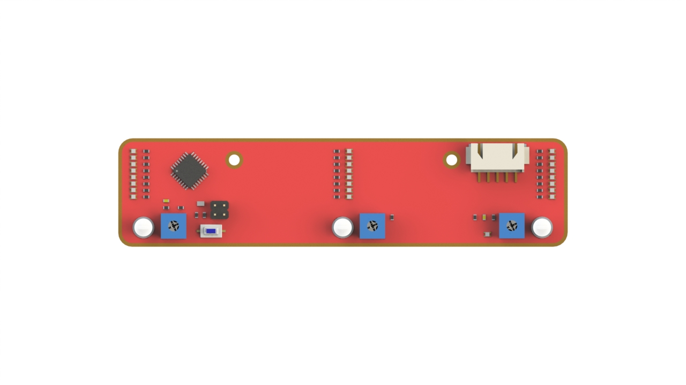
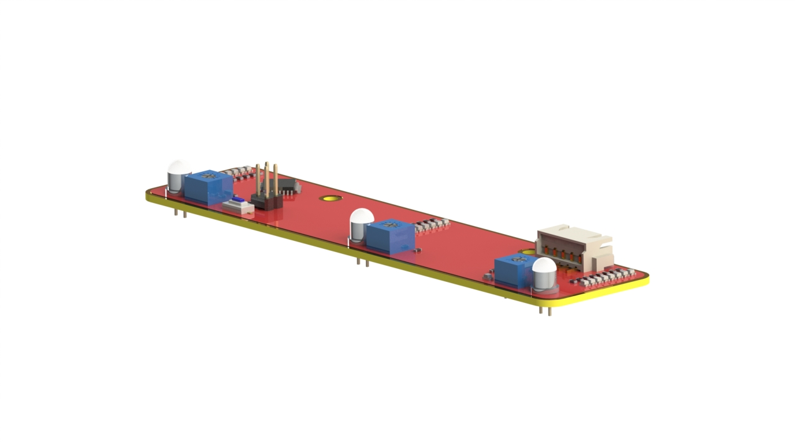
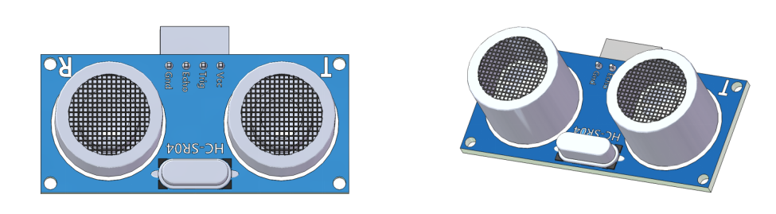
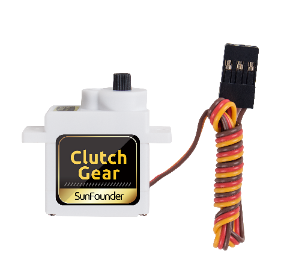
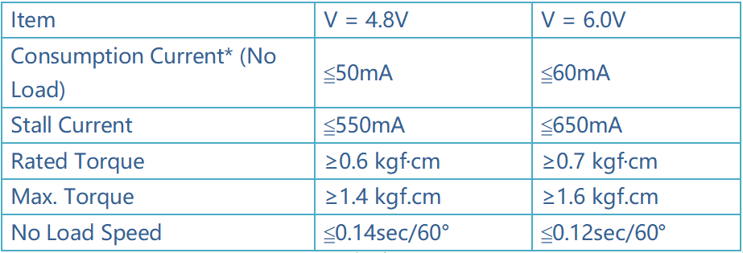
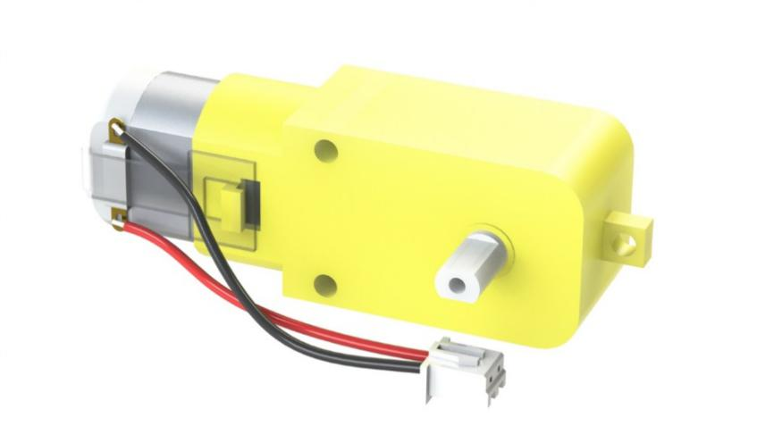

Modules
=======

Robot HATS
----------

.. image:: media/image135.jpeg

**Robot HATS** is a specially-designed HAT for a 40-pin Raspberry Pi and
can work with Raspberry Pi 3 model B, 3 model B +, and 4 model B. It
supplies power to the Raspberry Pi from the GPIO ports. Thanks to the
design of the ideal diode based on the rules of HATS, it can supply the
Raspberry Pi via both the USB cable and the DC port thus protecting it
from damaging the TF card caused by batteries running out of power. The
PCF8591 is used as the ADC chip, with I2C communication, and the address
0x48.

.. image:: media/image136.jpeg

**1.** **Digital ports**: 3-wire digital sensor ports, signal voltage:
3.3V, VCC voltage: 3.3V.

**2**. **Analog ports**: 3-wire 4-channel 8-bit ADC sensor port,
reference voltage: 3.3V, VCC voltage: 3.3V.

**3.** **I2C ports**: 3.3V I2C bus ports

**4**. **5V power output**: 5V power output to PWM driver.

**5**. **UART port**: 4-wire UART port, 5V VCC, perfectly working with
SunFounder FTDI Serial to USB.

**6**. **Motor control ports**: 5V for motors, direction control of
motors MA and MB and a floating pin NC; working with motor driver
module.

**7**. **Switch**: power switch

**8**. **Power indicators**: indicating the voltage – 2 indicators on:
>7.9V; 1 indicator on: 7.9V~7.4V; no indicator on: <7.4V. To protect the
batteries, you're recommended to take them out for charge when there is
no indicator on. The power indicators depend on the voltage
measured by the simple comparator circuit; the detected voltage may be
lower than normal depending on loads, so it is just for reference.

**9**. **Power port**: 5.5/2.1mm standard DC port, input voltage:
8.4~7.4V (limited operating voltage: 12V~6V).

PCA9865
-------

PCA9685 16-channel 12-bit I2C Bus PWM driver. It supports independent
PWM output power and is easy to use 4-wire I2C port for connection in
parallel, distinguished 3-color ports for PWM output.

1. **PWM output ports**: 3-color ports, independent power PWM output
port, connect to the servo directly.

2 & 3. **I2C port**: 4-wire I2C port, can be used in parallel.
Compatible with 3.3V/5.5V

4. **PWM power input**: 12V max.

5. **LED**: power indicator for the chip and for the PWM power input.

Motor Driver Module
-------------------

The Motor Driver module is a low heat generation one and small packaged
motor drive.

**1. Power and motor control port**: includes pins for supplying the
chip and the motors and controlling the motors' direction

**2. PWM input for the motors**: PWM signal input for adjusting the
speed of the two motors

**3. Motor output port**: output port for two motors

Line Follower Module
--------------------

The TCRT5000 infrared photoelectric switch adopts a high transmit power
infrared photodiode and a highly sensitive phototransistor. It works by
applying the principle of objects' reflecting IR light – the light is
emitted, then reflected, and sensed by the synchronous circuit. Then it
determines whether there exists an object or not by the light intensity.
It can easily identify black and white lines.

In other words, the different conduction levels of the phototransistor
when it passes over black and white lines can generate different output
voltages. Therefore, all we need to do is to collect data by the AD
converter on the Atmega328 and then send the data to the master control
board via I2C communication.

This module is an infrared tracking sensor one that uses 5 TRT5000
sensors. The blue LED of TRT5000 is the emission tube and after
electrified it emits infrared light invisible to human eye. The black
part of the sensor is for receiving; the resistance of the resistor
inside changes with the infrared light received.

Light Follower Module
---------------------

Phototransistor, also known as photodiode, is a device that converts
light to current. Currents are generated when photons are absorbed in
the P-N junction. When a reverse voltage is applied, the reverse current
in the device will change with the light luminance. The stronger the
light is, the larger the reverse current will be. Most phototransistors
work this way.

The ADC chip on the HATS can receive 8-bit analog signals and convert
them into integers, and transfer the signals to the Raspberry Pi. The
Raspberry Pi will analyze the data to determine the direction of the
brightest area (the light source), and further control the steering and
movement of the four wheels to approach the light source.

You may need a light focused flashlight in this experiment. At least,
the spot size of the torch should not be too big to reach all the 3
phototransistors on the module at the same time. Well, you can also
shine the flashlight closer to the car to get a small spot size.

Ultrasonic Obstacle Avoidance Module
------------------------------------

| The module contains an HC-SR04 ultrasonic distance sensor to detect
  the distance to an obstacle ahead. It is commonly used for robots to
  avoid obstacles. With the two holes, it can be easily mounted to the
  robot. A four foot anti-backwards cable is included to make the wiring
  tighter and easier.
| The HC-SR04 ultrasonic distance sensor provides non-contact
  measurement from 2cm to 400cm with a range accuracy of 3mm. each
  HC-SR04 module includes an ultrasonic transmitter, a receiver and a
  control circuit, so we have to be careful with the Trig and Echo pin
  connections when using the HC-SR04 module. When we attach it to the
  picar-s, it measures the distance and detects if there is an obstacle
  ahead.

**Principle**

Supply a short 10μS pulse to the Trig to start the ranging, and then the
module will send out an 8 cycle burst of ultrasound at 40 kHz and raise
its echo back. The echo is a distance object that is pulse width and the
range in proportion. You can calculate the :math:`\text{Range}` through
the :math:`\text{Time Interval}` between sending trigger signal and
receiving echo signal.

Formula:

.. math:: Range(m) = \frac{Time Interval \times 340_{m/s}}{2} 

Or:

.. math:: \text{Range}\left( \text{cm} \right) = \frac{\text{Time Interval}}{58}

Or:

.. math:: \text{Range}(inchs) = \frac{\text{Time Interval}}{148}

We suggest to use over 60ms measurement cycle, so as to prevent trigger
signal to the echo.

SunFounder SF006C Servo
-----------------------

The SunFounder SF0180 Servo is a 180-degree three-wire digital servo. It
utilizes PWM signal of 60Hz and has no physical limit – only control by
internal software to 180 degrees at most.

Electrical Specifications:

DC Gear Motor
-------------

It's a DC motor with a speed reducing gear train. See the parameters
below:

.. image:: media/image254.png

Copyright Notice
--------------------

All contents including but not limited to texts, images, and code in
this manual are owned by the SunFounder Company. You should only use it
for personal study, investigation, enjoyment, or other non-commercial or
nonprofit purposes, under the related regulations and copyrights laws,
without infringing the legal rights of the author and relevant right
holders. For any individual or organization that uses these for
commercial profit without permission, the Company reserves the right to
take legal action.