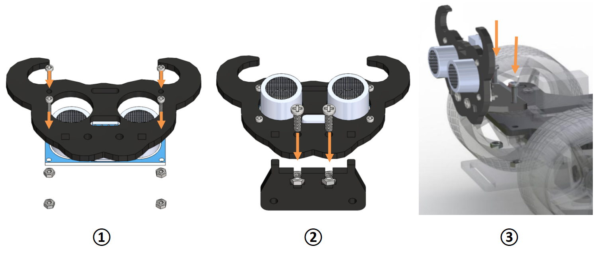
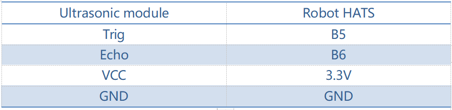
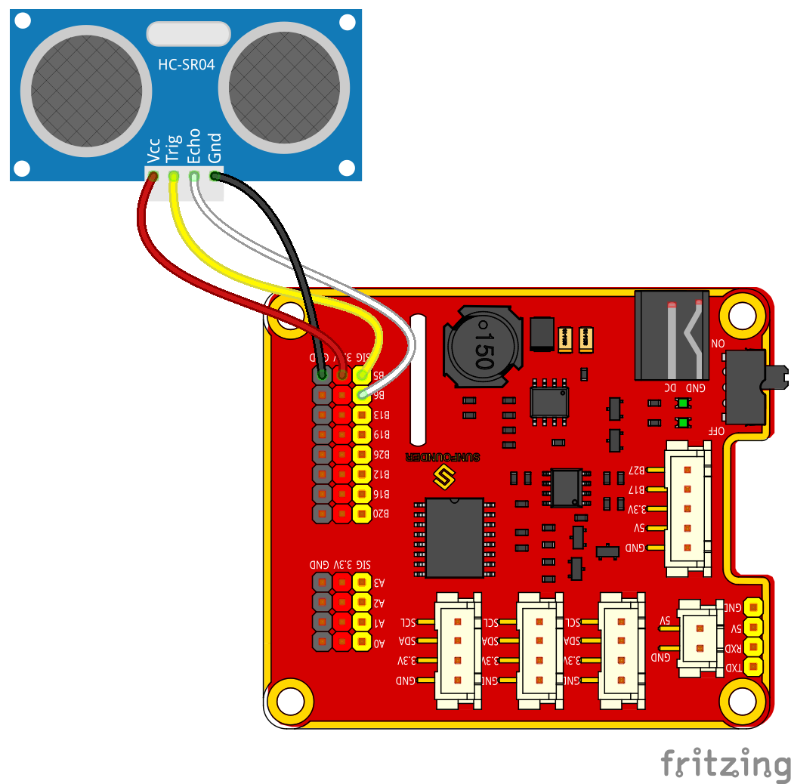
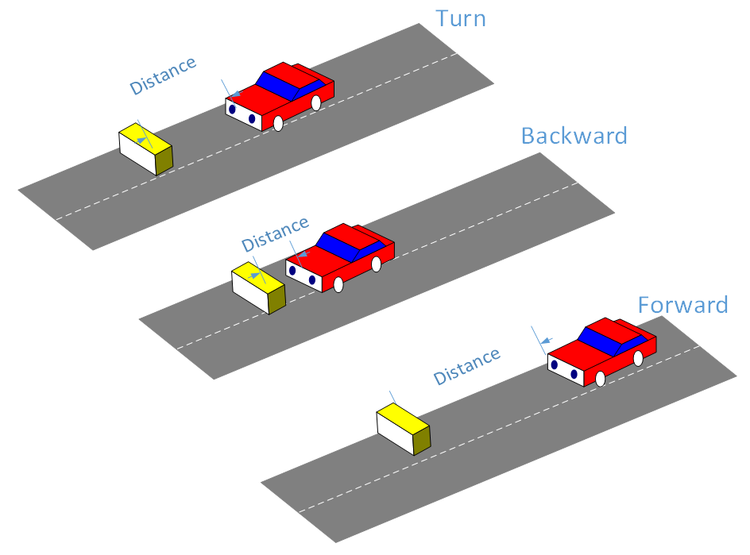
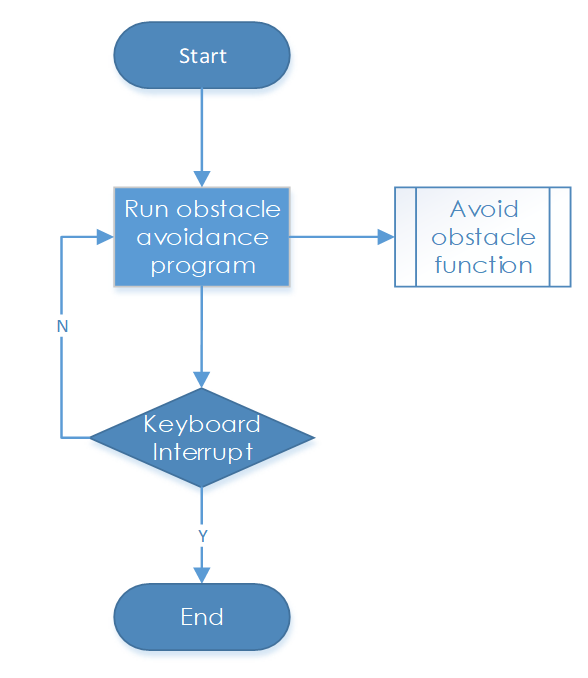
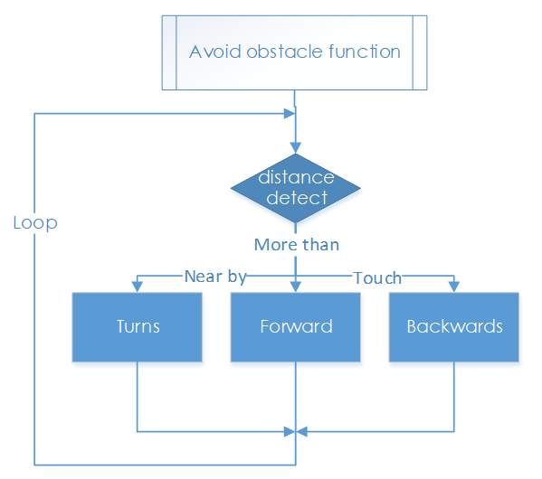

Obstacle Avoidance
===================

How it Works
----------------

The ultrasonic obstacle avoidance module detects and transfers the
collected data to Raspberry Pi that can calculate the distance from the
obstacle. The Pi will send a command to adjust the front wheels and rear
wheels direction and rotation to control the PiCar-S walk away from the
obstacle if there is one.

Procedures
-----------------

**Step 1 Assembly**

① Connect the ultrasonic module to the ultrasonic connector with M1.4*8
screws and M1.4 nuts.

② Then connect them to the ultrasonic support with M3*10 screws and M3
nuts.

③ Finally,assemble them to the Upper Plate with M3*10 screws and M3
nuts.

**Reminder: It would be easier to place the nuts into the slots with
your fingers to hold underneath.**

**Step 2 Wiring**

Connect the ultrasonic obstacle avoidance to Robot HATS with a 4-pin
anti-reverse cable as shown below.

Ultrasonic module can have a 5V or 3.3V power supply. Here, we give it a
3.3V power supply.

**Step 3 Test**

First, test the ultrasonic obstacle avoidance module before applying.

.. code-block::

    cd ~/SunFounder_PiCar-S/example/

.. code-block::

    python3 test_ultrasonic_module.py

.. image:: media/image109.png

You may find that the distance measurement may be not that accurate. It
doesn’t matter. This 25kHz ultrasonic module is not a commonly used one,
but one has a **horizontal detecting range of about 30~40 degrees**.
Thus the distance measured may be not so accurate, but that small range
provides convenience for obstacle avoidance. Besides, since the
Raspberry Pi is not a real-time operating system, the inaccurate time
calculation will affect the accuracy of distance measurement too.
However, this ultrasonic module is precise enough for obstacle
avoidance.

**Step 4. Get on the road!**

Now we have a general idea of the ultrasonic module’s effect after the
test above. Let’s run the code of the ultrasonic obstacle avoidance.

.. code-block::

    python3 ultra_sonic_avoid.py

The PiCar-S starts running now. Just place the car on the ground. It
will follow the program to turn when it detects an obstacle; if the
obstacle is too close, it will move backwards, and turn left/right. You
can also modify the threshold of obstacle detecting range and that of
moving backwards in the code.

Code Explanation for ultra_sonic_avoid.py
-----------------------------------------------

**Whole Work Flow**

The ultrasonic module returns a digital value, i.e., High or Low level,
and the interval time between two levels returned can be converted to
the distance to the obstacle. Thus, we call the time module in Python
for timing here. The formula to calculate the distance is written in the
ultrasonic module’s driver. The main program just calls the
corresponding program to get the distance value.

**Subflow of the Obstacle Avoidance Function**

When the car starts, it will detect obstacles and measure the distance
in cycle, make judgement, and take actions. Here are three cases: when
the distance to the obstacle is equals to the threshold, the car will
turn directions; when the distance is less than the threshold, the car
will move backwards before turning direction; when the distance is more
than the threshold, it will keep moving forwards.

**Functions Explanation**

**ua = Ultra_Sonic.UltraSonic_Avoidance(17)**

Create an object **ua** of a *UltraSonic_Avoidance* class in the
Ultra_Sonic module. The number in the round bracket is the initial
parameter, which represents the pin number the SIG of the module is
connected to. Since the BCM naming method is applied, the corresponding
pin on the Raspberry Pi is #17.

**back_distance** and **turn_distance**, two constants are to set the
thresholds of the ranging distance.

**while()** loop

When the detected distance is less than the **back_distance**, the car
will move backwards; when it is between **back_distance** and
**turn_distance**, the car will turn a direction (you can set the
turning angle in the aforementioned parameter **turning_angle** and the
angle can be a positive or negative number, for turning left or turning
right respectively; **NOTE** that the number of the turning angle should
be **-90 to 90** considering the servo’s max rotation degrees, or the
servo may be burnt.); when the detected distance is greater than the
**turn_distance**, the car will keep moving forward.

**bw.backward()**, making the rear wheels rotate backwards;
**bw.forward()**, making the rear wheels spin forward. These two
functions in the rear wheel driving module back_wheels are to set the
wheel’s rotating direction.

**bw.set_speed(speed)**, function in the back_wheels, to set the wheel's
rotating speed. The larger the number (within the range 0-100) is, the
faster the wheel rotates.

**fw.turn(angle)**, function in the back_wheels, to set the turning
angle. The angle is 90 when the car moves straight forwards; reduce the
number to turn left, and increase it to turn right.

**fw.turn_straight()**, making the front wheels return to the angle of
moving straight forwards.

**More:**

**back_distance** and **turn_distance**

Try to modify the constants to make the car back off and turn away in a
desired distance and angle as you like during the obstacle avoidance.